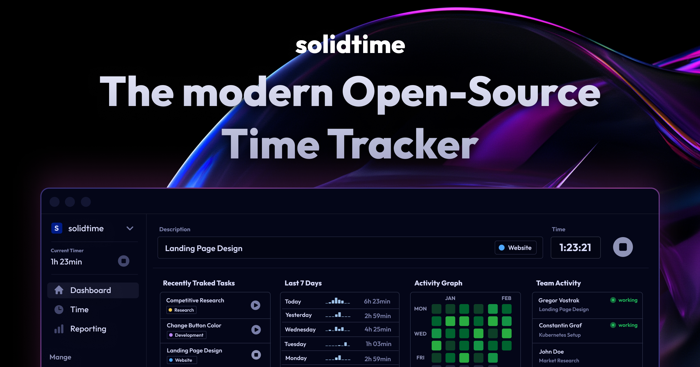

# solidtime - The modern Open-Source Time Tracker




solidtime is a modern open-source time tracking application for Freelancers and Agencies.

## Features

 - Time tracking: Track your time with a modern and easy-to-use interface
 - Projects: Create and manage projects and assign project members
 - Tasks: Create and manage tasks and assign tasks to project members
 - Clients: Create and manage clients and assign clients to projects
 - Billable rates: Set billable rates for projects, project members, organization members and organizations 
 - Multiple organizations: Create and manage multiple organizations with one account
 - Roles and permissions: Create and manage organizations
 - Import: Import your time tracking data from other time tracking applications (Supported: Toggl, Clockify, Timeentry CSV)

## Local setup for development

**System requirements**
 * Docker

First you need to download or clone the repository f.e. with `git@github.com:solidtime-io/solidtime.git`. 

After that, execute the following commands **inside the project folder**: 

```bash
docker run --rm \
    --pull=always \
    -v "$(pwd)":/opt \
    -w /opt \
    laravelsail/php83-composer:latest \
    bash -c "composer install --ignore-platform-reqs"

cp .env.example .env

./vendor/bin/sail up -d

./vendor/bin/sail artisan key:generate

./vendor/bin/sail artisan migrate:fresh --seed

./vendor/bin/sail php artisan passport:install

./vendor/bin/sail npm install

./vendor/bin/sail npm run build
```

Make sure to set the APP_PORT and VITE_PORT inside your `.env` file to a port that is not already used by your system.

By default the application will run on [localhost:8083](http://localhost:8083/)

### Setup with Reverse Proxy

**Additional System Requirements**
* Traefik 2 Reverse-Proxy (https://github.com/korridor/reverse-proxy-docker-traefik)

Add the following entry to your `/etc/hosts`

```
127.0.0.1 solidtime.test
127.0.0.1 playwright.solidtime.test
127.0.0.1 vite.solidtime.test
127.0.0.1 mail.solidtime.test
```

### Running E2E Tests

`./vendor/bin/sail up -d ` will automatically start a Playwright UI server that you can access at `https://playwright.solidtime.test`. 
Make sure that you use HTTPS otherwise the resources will not be loaded correctly.

### Recording E2E Tests

To record E2E tests, you need to install and execute playwright locally (outside the Docker container) using: 

```bash
npx playwright install
npx playwright codegen solidtime.test
``` 

### E2E Troubleshooting

If E2E tests are not working at all, make sure you do not have the Vite server running and just run `npm run build` to update the version.
If the E2E tests are not working consistently and fail with a timeout during the authentication, you might want to delete the `test-results/.auth` directory to force new test accounts to be created.

### Generate ZOD Client

The Zodius HTTP client is generated using the following command:

```bash
npm run zod:generate
```

## Contributing

This project is in a very early stage. The structure and APIs are still subject to change and not stable. 
Therefore, we do not currently accept any contributions, unless you are a member of the team.

As soon as we feel comfortable enough that the application structure is stable enough, we will open up the project for contributions.

## Security

Looking to report a vulnerability? Please refer our [SECURITY.md](./SECURITY.md) file.

## License

This project is open-source and available under the GNU Affero General Public License v3.0 (AGPL v3). Please see the [license file](LICENSE.md) for more information.
